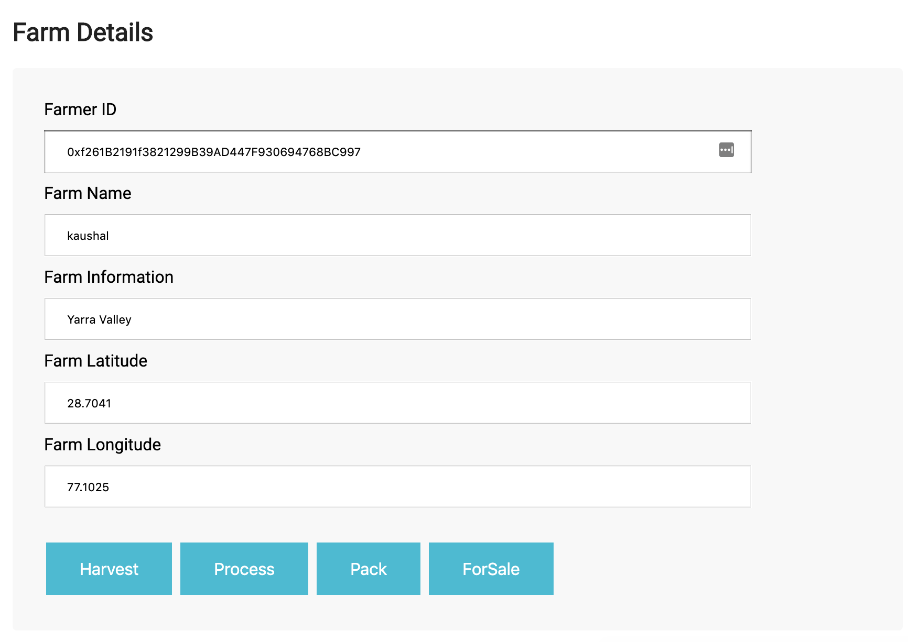
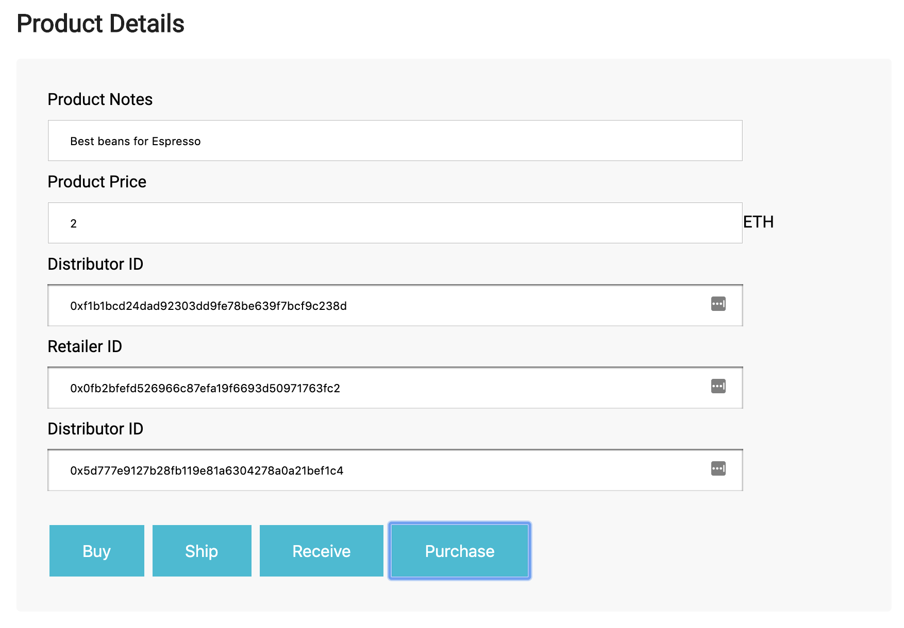
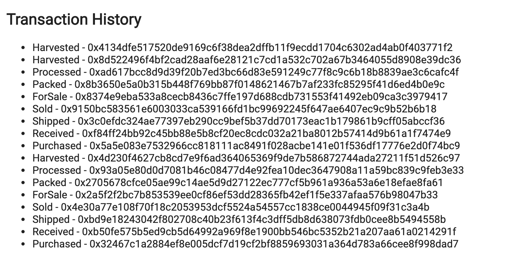
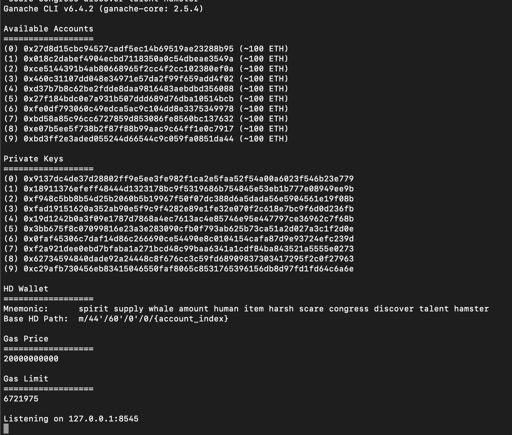
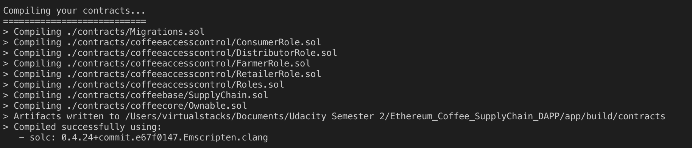
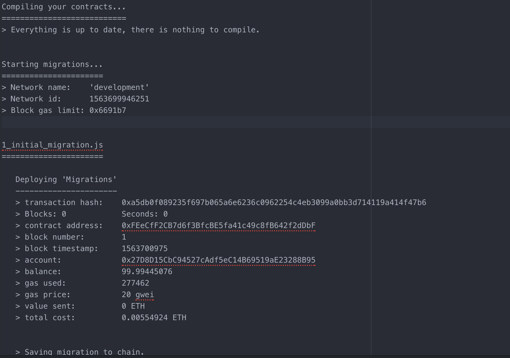
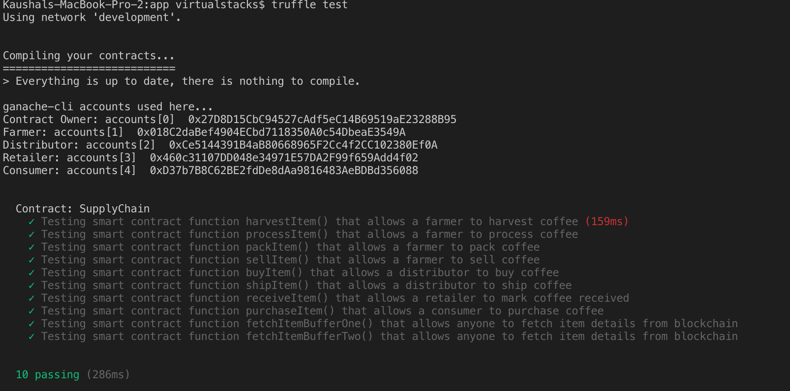
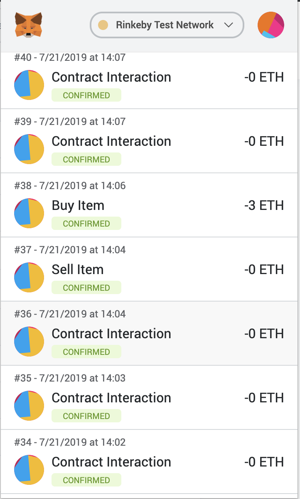
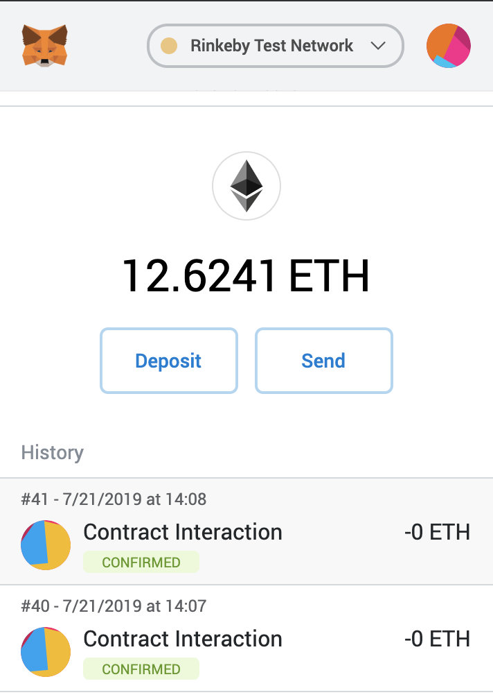

# Supply chain & data auditing

This repository containts an Ethereum DApp that demonstrates a Supply Chain flow between a Seller and Buyer. The user story is similar to any commonly used supply chain process. A Seller can add items to the inventory system stored in the blockchain. A Buyer can purchase such items from the inventory system. Additionally a Seller can mark an item as Shipped, and similarly a Buyer can mark an item as Received.

The DApp User Interface when running should look like...









## Getting Started

These instructions will get you a copy of the project up and running on your local machine for development and testing purposes. See deployment for notes on how to deploy the project on a live system.

### Prerequisites

Please make sure you've already installed ganache-cli, Truffle and enabled MetaMask extension in your browser.

```
Give examples (to be clarified)
```

### Installing

A step by step series of examples that tell you have to get a development env running

Clone this repository:

```
git clone https://github.com/kaushal9678/Ethereum_coffee_SupplyChain_DAPP.git
```

Change directory to ```app``` folder and install all requisite npm packages (as listed in ```package.json```):

```
cd app
npm install
```

Launch Ganache:

```
ganache-cli -m "spirit supply whale amount human item harsh scare congress discover talent hamster"
```

Your terminal should look something like this:



In a separate terminal window, Compile smart contracts:

```
truffle compile


Your terminal should look something like this:



This will create the smart contract artifacts in folder ```build\contracts```.

Migrate smart contracts to the locally running blockchain, ganache-cli:

```
truffle migrate
```

Your terminal should look something like this:


```
Kaushals-MacBook-Pro-2:app virtualstacks$ truffle migrate

Compiling your contracts...
===========================
> Everything is up to date, there is nothing to compile.


Starting migrations...
======================
> Network name:    'development'
> Network id:      1563699946251
> Block gas limit: 0x6691b7


1_initial_migration.js
======================

   Deploying 'Migrations'
   ----------------------
   > transaction hash:    0xa5db0f089235f697b065a6e6236c0962254c4eb3099a0bb3d714119a414f47b6
   > Blocks: 0            Seconds: 0
   > contract address:    0xFEeCfF2CB7d6f3BfcBE5fa41c49c8fB642f2dDbF
   > block number:        1
   > block timestamp:     1563700975
   > account:             0x27D8D15CbC94527cAdf5eC14B69519aE23288B95
   > balance:             99.99445076
   > gas used:            277462
   > gas price:           20 gwei
   > value sent:          0 ETH
   > total cost:          0.00554924 ETH


   > Saving migration to chain.
   > Saving artifacts
   -------------------------------------
   > Total cost:          0.00554924 ETH


2_deploy_contracts.js
=====================

   Deploying 'FarmerRole'
   ----------------------
   > transaction hash:    0x0b72cb723bb3026e3205af31f01c51453b34dcb0fc544a456075f15c9d2e63b9
   > Blocks: 0            Seconds: 0
   > contract address:    0xf2ee0b0Cdcae5013930B92c0Ba54F7F7f1933613
   > block number:        3
   > block timestamp:     1563700976
   > account:             0x27D8D15CbC94527cAdf5eC14B69519aE23288B95
   > balance:             99.98585746
   > gas used:            387657
   > gas price:           20 gwei
   > value sent:          0 ETH
   > total cost:          0.00775314 ETH


   Deploying 'DistributorRole'
   ---------------------------
   > transaction hash:    0x1c1d49f499c117f86df289e4dac595c5de837bb86e3540609eee48cd839319a6
   > Blocks: 0            Seconds: 0
   > contract address:    0xd22De155853B67cE1cA3693FBE52EE958f755E7b
   > block number:        4
   > block timestamp:     1563700976
   > account:             0x27D8D15CbC94527cAdf5eC14B69519aE23288B95
   > balance:             99.97810432
   > gas used:            387657
   > gas price:           20 gwei
   > value sent:          0 ETH
   > total cost:          0.00775314 ETH


   Deploying 'RetailerRole'
   ------------------------
   > transaction hash:    0xea9a4b07ebc48188b73a5a2cd0191fe5e841efa25da9fb5129fc810ad62f29ff
   > Blocks: 0            Seconds: 0
   > contract address:    0x79051A2faFcC216A55d3897474012145d158F170
   > block number:        5
   > block timestamp:     1563700976
   > account:             0x27D8D15CbC94527cAdf5eC14B69519aE23288B95
   > balance:             99.97034862
   > gas used:            387785
   > gas price:           20 gwei
   > value sent:          0 ETH
   > total cost:          0.0077557 ETH


   Deploying 'ConsumerRole'
   ------------------------
   > transaction hash:    0x5c471e3d819fb266146983b5167dc9e8caef3cdc7dca1796bcd1c33c36fb6ae3
   > Blocks: 0            Seconds: 0
   > contract address:    0xA65B87754E0A73860AA6B7eb6E95D79CD2d893d2
   > block number:        6
   > block timestamp:     1563700976
   > account:             0x27D8D15CbC94527cAdf5eC14B69519aE23288B95
   > balance:             99.96259676
   > gas used:            387593
   > gas price:           20 gwei
   > value sent:          0 ETH
   > total cost:          0.00775186 ETH


   Deploying 'SupplyChain'
   -----------------------
   > transaction hash:    0xebf5ad372cf3bc959553c82a902a5f616a51122446144d0d893604ffb2764cd7
   > Blocks: 0            Seconds: 0
   > contract address:    0x23E2b13b08a22E9eEe431F862eC7A17aB1E99B98
   > block number:        7
   > block timestamp:     1563700976
   > account:             0x27D8D15CbC94527cAdf5eC14B69519aE23288B95
   > balance:             99.90432842
   > gas used:            2913417
   > gas price:           20 gwei
   > value sent:          0 ETH
   > total cost:          0.05826834 ETH


   > Saving migration to chain.
   > Saving artifacts
   -------------------------------------
   > Total cost:          0.08928218 ETH


Summary
=======
> Total deployments:   6
> Final cost:          0.09483142 ETH


```


###Test smart contracts:

```
truffle test
```

All 10 tests should pass.



In a separate terminal window, launch the DApp:

```
npm run dev
```

## Deploy to Rinkeby Network
use following command

```
truffle migrate --reset --network rinkeby

```
Above command returns following output

```

Compiling your contracts...
===========================
> Everything is up to date, there is nothing to compile.


Migrations dry-run (simulation)
===============================
> Network name:    'rinkeby-fork'
> Network id:      4
> Block gas limit: 0x6ab93f


1_initial_migration.js
======================

   Deploying 'Migrations'
   ----------------------
   > block number:        4771119
   > block timestamp:     1563696658
   > account:             0x5D61dd25FA5cE989907aA2718Bc92b6427116b23
   > balance:             18.694913957
   > gas used:            262462
   > gas price:           10 gwei
   > value sent:          0 ETH
   > total cost:          0.00262462 ETH

   -------------------------------------
   > Total cost:          0.00262462 ETH


2_deploy_contracts.js
=====================

   Deploying 'FarmerRole'
   ----------------------
   > block number:        4771121
   > block timestamp:     1563696668
   > account:             0x5D61dd25FA5cE989907aA2718Bc92b6427116b23
   > balance:             18.690917307
   > gas used:            372657
   > gas price:           10 gwei
   > value sent:          0 ETH
   > total cost:          0.00372657 ETH


   Deploying 'DistributorRole'
   ---------------------------
   > block number:        4771122
   > block timestamp:     1563696677
   > account:             0x5D61dd25FA5cE989907aA2718Bc92b6427116b23
   > balance:             18.687190737
   > gas used:            372657
   > gas price:           10 gwei
   > value sent:          0 ETH
   > total cost:          0.00372657 ETH


   Deploying 'RetailerRole'
   ------------------------
   > block number:        4771123
   > block timestamp:     1563696685
   > account:             0x5D61dd25FA5cE989907aA2718Bc92b6427116b23
   > balance:             18.683462887
   > gas used:            372785
   > gas price:           10 gwei
   > value sent:          0 ETH
   > total cost:          0.00372785 ETH


   Deploying 'ConsumerRole'
   ------------------------
   > block number:        4771124
   > block timestamp:     1563696692
   > account:             0x5D61dd25FA5cE989907aA2718Bc92b6427116b23
   > balance:             18.679736317
   > gas used:            372657
   > gas price:           10 gwei
   > value sent:          0 ETH
   > total cost:          0.00372657 ETH


   Deploying 'SupplyChain'
   -----------------------
   > block number:        4771125
   > block timestamp:     1563696710
   > account:             0x5D61dd25FA5cE989907aA2718Bc92b6427116b23
   > balance:             18.651502147
   > gas used:            2823417
   > gas price:           10 gwei
   > value sent:          0 ETH
   > total cost:          0.02823417 ETH

   -------------------------------------
   > Total cost:          0.04314173 ETH


Summary
=======
> Total deployments:   6
> Final cost:          0.04576635 ETH


Starting migrations...
======================
> Network name:    'rinkeby'
> Network id:      4
> Block gas limit: 0x6acfc0


1_initial_migration.js
======================

   Deploying 'Migrations'
   ----------------------
   > transaction hash:    0xf45bc6343e2391c938db7d11e0484cd23669b62890f9d9ff5ef38735857a22da
   > Blocks: 2            Seconds: 21
   > contract address:    0x4791F09E9eB780dcE03D2a91aB84d69f23755B31
   > block number:        4771125
   > block timestamp:     1563696755
   > account:             0x5D61dd25FA5cE989907aA2718Bc92b6427116b23
   > balance:             18.694763957
   > gas used:            277462
   > gas price:           10 gwei
   > value sent:          0 ETH
   > total cost:          0.00277462 ETH


   > Saving migration to chain.
   > Saving artifacts
   -------------------------------------
   > Total cost:          0.00277462 ETH


2_deploy_contracts.js
=====================

   Deploying 'FarmerRole'
   ----------------------
   > transaction hash:    0x8675019e93efdc362bbc3dd8cb2f5e62019311404889e711c15e64c3738cd91a
   > Blocks: 0            Seconds: 6
   > contract address:    0xd1BEdEE96c23eB989Ee7b161B12857ab3afEBF51
   > block number:        4771127
   > block timestamp:     1563696785
   > account:             0x5D61dd25FA5cE989907aA2718Bc92b6427116b23
   > balance:             18.690467307
   > gas used:            387657
   > gas price:           10 gwei
   > value sent:          0 ETH
   > total cost:          0.00387657 ETH


   Deploying 'DistributorRole'
   ---------------------------
   > transaction hash:    0x67e174e2f812b167ac740aef6811dd75e51e4be75c1f11997720913620f7fa97
   > Blocks: 2            Seconds: 21
   > contract address:    0x756F960c2371128ee473058988f4a139AcB2f987
   > block number:        4771129
   > block timestamp:     1563696815
   > account:             0x5D61dd25FA5cE989907aA2718Bc92b6427116b23
   > balance:             18.686590737
   > gas used:            387657
   > gas price:           10 gwei
   > value sent:          0 ETH
   > total cost:          0.00387657 ETH


   Deploying 'RetailerRole'
   ------------------------
   > transaction hash:    0xe5b78632f9f0d327634e61b01719c7b84092ce8ad99a149cc01230b33e642f99
   > Blocks: 1            Seconds: 21
   > contract address:    0xb12D75b47054eD3cC288E742c021e41B9b06e33a
   > block number:        4771131
   > block timestamp:     1563696845
   > account:             0x5D61dd25FA5cE989907aA2718Bc92b6427116b23
   > balance:             18.682712887
   > gas used:            387785
   > gas price:           10 gwei
   > value sent:          0 ETH
   > total cost:          0.00387785 ETH


   Deploying 'ConsumerRole'
   ------------------------
   > transaction hash:    0x99aeca1a7d88a1efb30f32c252fb2401fbbf76b492ce9a231d8cf86ba18a6a2b
   > Blocks: 0            Seconds: 5
   > contract address:    0x1775012dC1AE00A1401D96803d87B6045c49eC57
   > block number:        4771132
   > block timestamp:     1563696860
   > account:             0x5D61dd25FA5cE989907aA2718Bc92b6427116b23
   > balance:             18.678836317
   > gas used:            387657
   > gas price:           10 gwei
   > value sent:          0 ETH
   > total cost:          0.00387657 ETH


   Deploying 'SupplyChain'
   -----------------------
   > transaction hash:    0xb55b1c36bd5c1ce9f8fc9700c6b9ea1e57c4b7bf5eb782f69ad95ae10ad80e95
   > Blocks: 1            Seconds: 22
   > contract address:    0xb4FfCfE41Eb6fE80cA8853c96945124F57e3D836
   > block number:        4771134
   > block timestamp:     1563696890
   > account:             0x5D61dd25FA5cE989907aA2718Bc92b6427116b23
   > balance:             18.649702147
   > gas used:            2913417
   > gas price:           10 gwei
   > value sent:          0 ETH
   > total cost:          0.02913417 ETH


   > Saving migration to chain.
   > Saving artifacts
   -------------------------------------
   > Total cost:          0.04464173 ETH


Summary
=======
> Total deployments:   6
> Final cost:          0.04741635 ETH

```

While doing transaction on Rinkeby network following are the MetaMask history





## Built With

* [Ethereum](https://www.ethereum.org/) - Ethereum is a decentralized platform that runs smart contracts
* [IPFS](https://ipfs.io/) - IPFS is the Distributed Web | A peer-to-peer hypermedia protocol
to make the web faster, safer, and more open.
* [Truffle Framework](http://truffleframework.com/) - Truffle is the most popular development framework for Ethereum with a mission to make your life a whole lot easier.


## Authors

See also the list of [contributors](https://github.com/your/project/contributors.md) who participated in this project.

## Acknowledgments

* Solidity
* Ganache-cli
* Truffle
* IPFS
